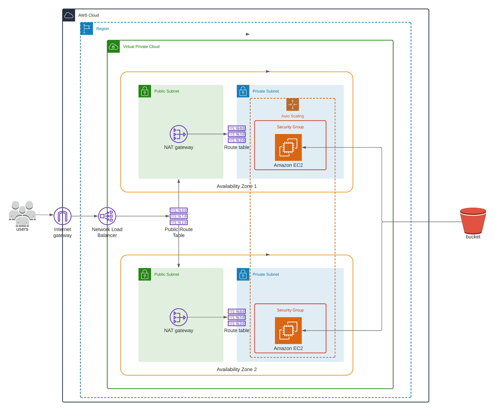

# Deploy a high-availability web app using CloudFormation
The goal of the project is to deploy a web app, along with the necessary supporting software into its matching infrastructure, which needs to be done in an automated fashion so that the infrastructure can be discarded as soon as the testing team finishes their tests and gathers their results.

## Steps
1. Upload `index.html.zip` to S3 and obtain the path. Make the S3 bucket public accessible.

2. Use the `create.sh` script to first build the network stack and then the server stack. The architecture is shown below.

3. Obtain the load balancer url from the output of the server stack.
http://serve-WebAp-211Q0OOI82XP-199018980.us-east-1.elb.amazonaws.com

4. Visit the url and you would be able to see the website defined by the `index.html` file which was uploaded to the S3 bucket.
